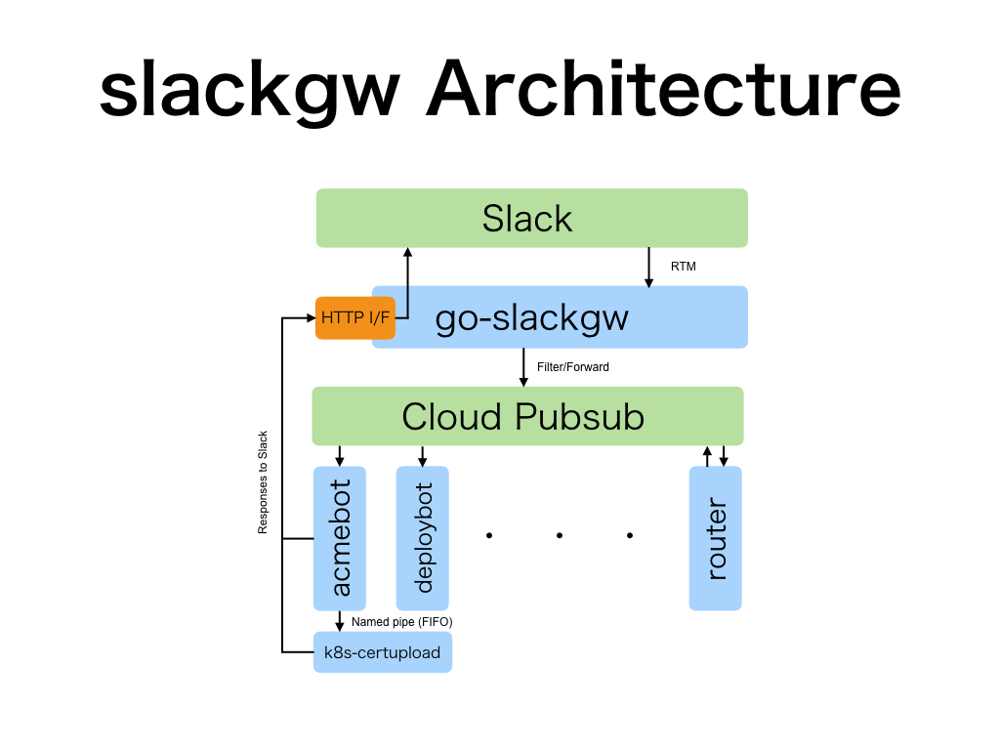

# slackgw

## SYNOPSIS

`slackgw` stands for `Slackge Gateway`. It has two purposes:

1. Slackbot Gateway - To receive events from Slack, and interpret/pass on stuff to background workers (e.g. ACME bot)
2. Slack HTTP I/F - To receive HTTP requests and post messages on behalf of the requestor

## ARCHITECTURE

### Slackbot Gateway

[go-slackgw](https://github.com/lestrrat/go-slackgw) by default receives all events from Slack via RTM (Real Time Messaging) and filters events, and does whatever you specify it to. In our setup, it sends images to [Cloud Pubsub](https://cloud.google.com/pubsub/overview), in a topic named `projects/builderscon-1248/topics/slackgw-forward`.

Various bots can subscribe to this topic and do their processing.

### Slack HTTP I/F

You may post to the `slackgw` service (port 4979) to post messages to our Slack team. There is no security, as we only allow access from within our network.

## acmebot

`acmebot` currently can 

* Authorize domains (via dns-01 challenge)
* Issue certificates
* Upload certificates to Kubernetes secrets

### Commands

| Command                       | Description |
|-------------------------------|-------------|
| acme authz request **domain** | Authorize a domain using dns-01 |
| acme authz delete <domain>    | Delete previous authorization from storage |
| acme cert issue <domain>      | Issue new certificates |
| acme cert delete <domain>     | Delete previous certificates |
| acme cert upload <domain>     | Upload certificates to Kubernetes as a secret |

